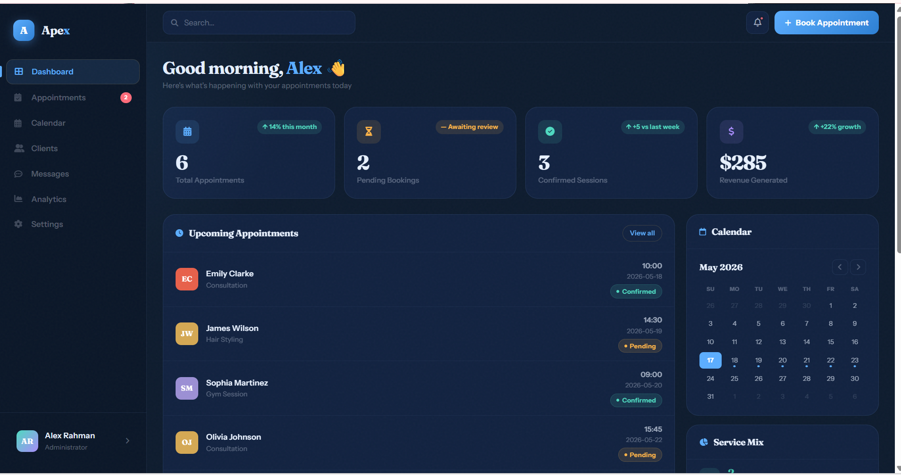
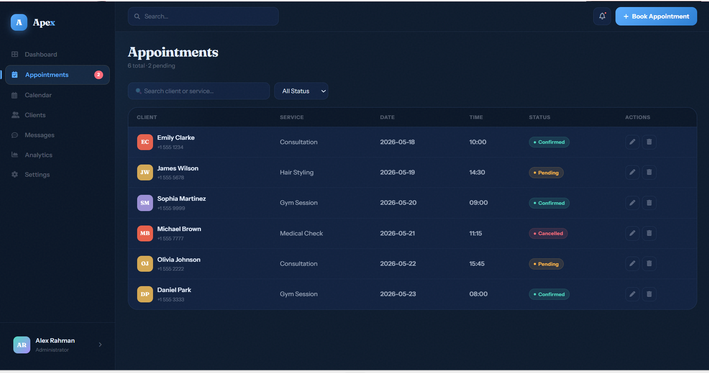
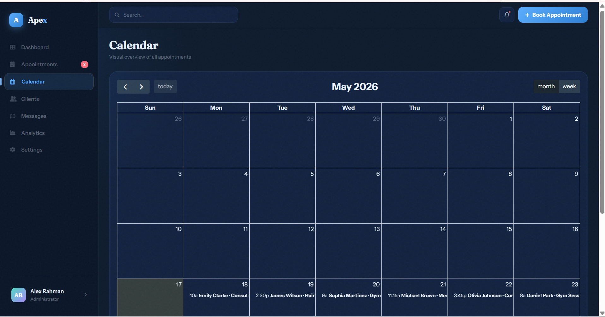
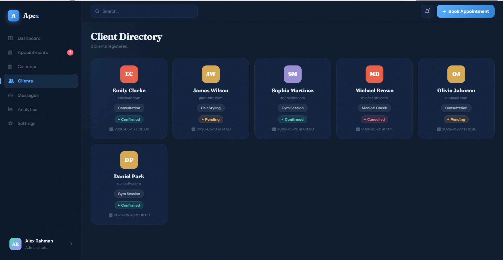
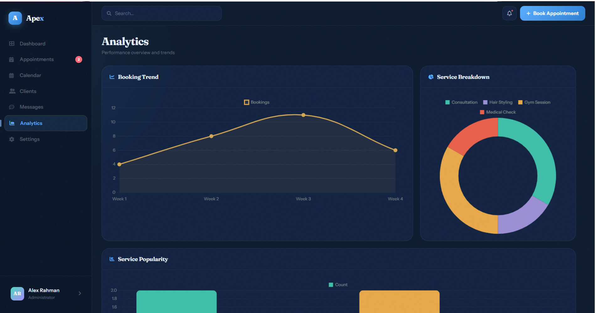
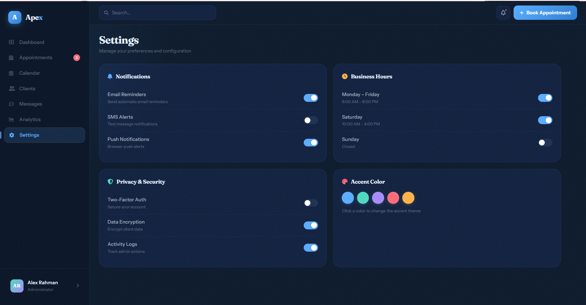
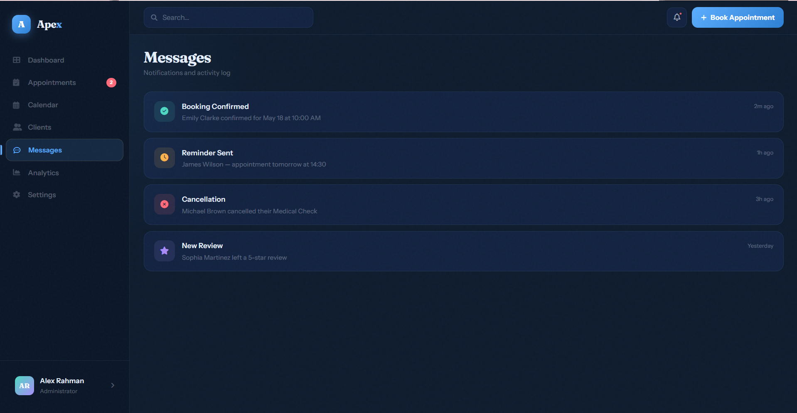

# 🚀 Apex — Appointment Dashboard

[](https://opensource.org/licenses/MIT)
[](#)
[](#)
[](#)

**Apex** is a sophisticated, single-file HTML dashboard for managing appointments, clients, and business analytics. It features a modern dark-mode UI, real-time data visualization, and a fully interactive calendar, making it perfect for salons, clinics, gyms, or any service-based business.

---

## 📸 Screenshots

### Dashboard View


### Appointments View


### Calendar View


### Clients View


### Analytics View


### Settings View


### Messages View


---

## ✨ Key Features

- **📊 Real-time Dashboard** - View key metrics (KPIs), upcoming appointments, and service mix at a glance
- **📅 Smart Calendar** - FullCalendar integration for weekly/monthly visual overview
- **👥 Client Directory** - Dedicated section to view all clients and their appointment history
- **📈 Analytics Hub** - Interactive charts (Line, Doughnut, Bar) to track booking trends and service popularity
- **🔔 Notification System** - Sleek toast notification system for all CRUD actions
- **🎨 Dynamic Theming** - Change the entire accent color of the UI on the fly from Settings
- **📱 Fully Responsive** - Optimized for desktops, tablets, and mobile devices with collapsible sidebar
- **⚡ Zero Dependencies (Almost)** - Built with vanilla JS, HTML5, CSS3 + two industry-standard libraries
- **🔍 Search & Filter** - Global search and status-based filtering for appointments
- **✏️ Complete CRUD** - Create, Read, Update, and Delete appointments seamlessly

---

## 🛠️ Built With

| Technology | Purpose |
|------------|---------|
| **HTML5** | Semantic structure |
| **CSS3** | Custom properties, animations, flexbox/grid layouts |
| **Vanilla JavaScript** | Core logic, DOM manipulation, state management |
| **Chart.js** | Simple and beautiful charts |
| **FullCalendar** | Powerful calendar views |
| **Font Awesome 6** | High-quality icons |
| **Google Fonts** | Fraunces (display) & Instrument Sans (body) fonts |

---

## 🚀 Getting Started

### Prerequisites
- A modern web browser (Chrome, Firefox, Safari, Edge)
- Internet connection (for CDN resources on first load)

### Installation

#### Method 1: Direct Download
1. Download the `index.html` file
2. Double-click to open in your browser

#### Method 2: Clone Repository
```bash
git clone https://github.com/your-username/apex-dashboard.git
cd apex-dashboard
```
**Method 3: Run with Live Server**
```bash
# Python
python -m http.server 8000

# VS Code
# Install "Live Server" extension → Right-click index.html → Open with Live Server

# Node.js
npx serve .
```
Then open http://localhost:8000 in your browser.

